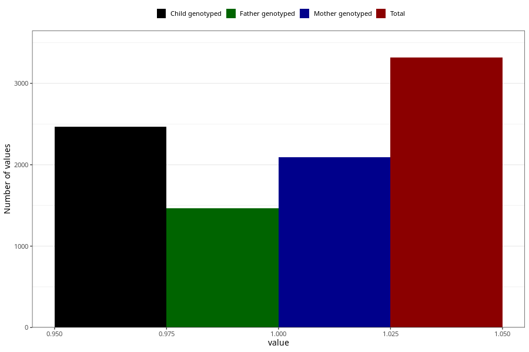

# vaginal_catarrh_unusual_discharge_9w_12w
Variable mapping to questionnaire: q1m, question AA248.
.
- Number of values:

| Value | Total | Child genotyped | Mother genotyped | Father genotyped |
| ----- | ----- | --------------- | ---------------- | ---------------- |
| Missing | 110306 | 80889 | 69679 | 48756 |
| 1 | 3317 | 2466 | 2090 |1462 |

