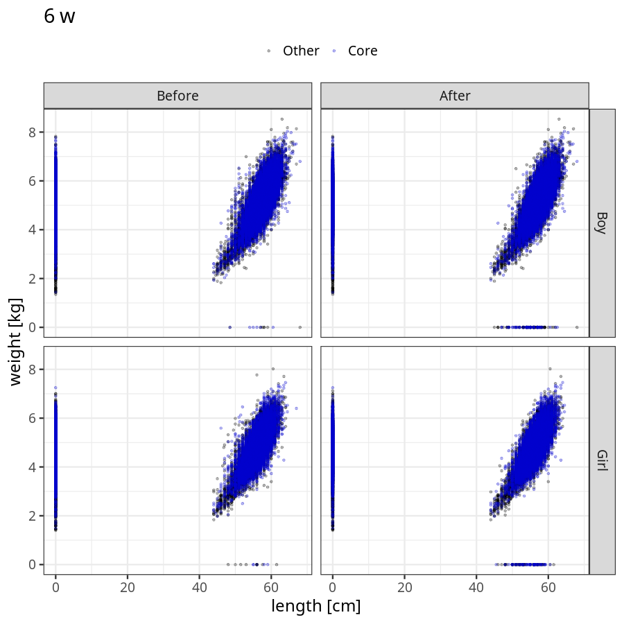
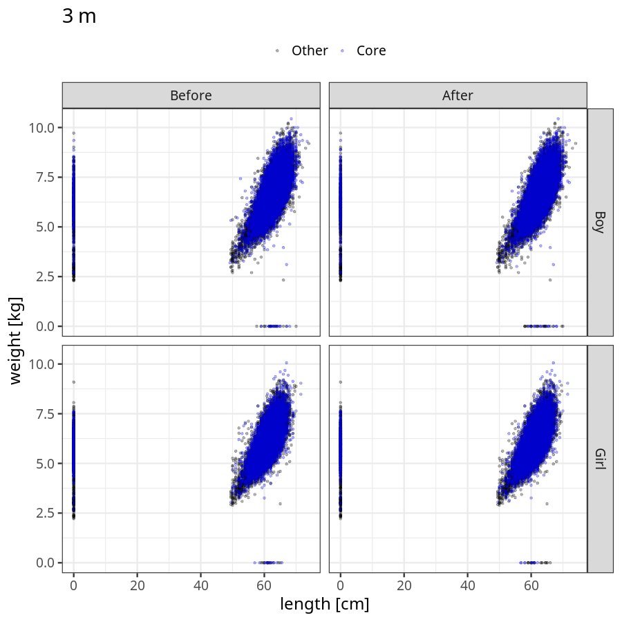
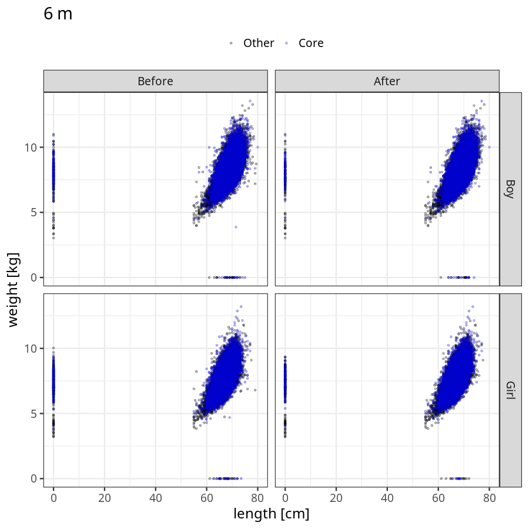
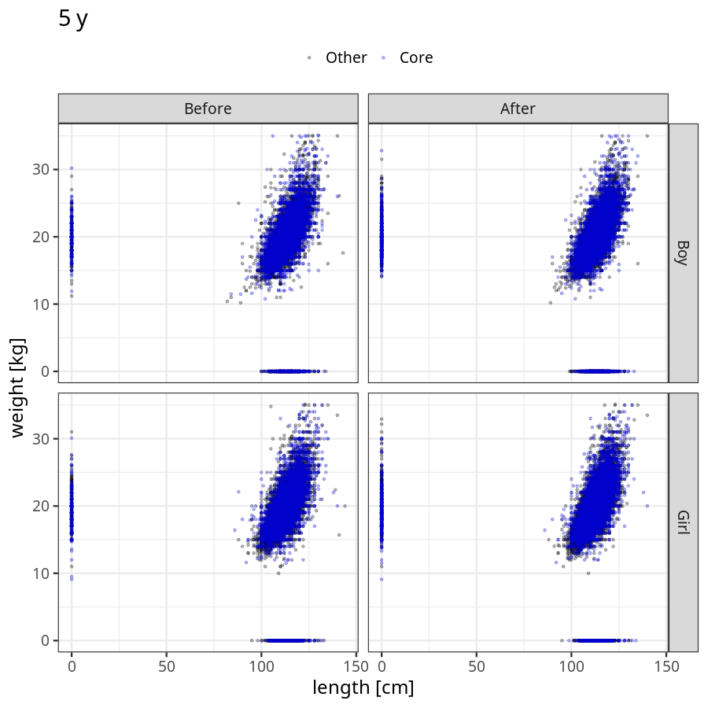

# Phenotypes
### Number of values

### Length vs weight

### Imputation
- Children with no data point altered: 68741
- Children with at least one data point altered: 44882
#### Random example: 48185
> imputed@length_16m imputed@length_2y imputed@weight_16m imputed@weight_2y

#### Random example: 38729
> imputed@length_16m imputed@length_2y imputed@weight_16m imputed@weight_2y

#### Random example: 79410
> imputed@length_16m imputed@length_2y imputed@weight_16m imputed@weight_2y

#### Random example: 80595
> imputed@length_16m imputed@length_2y imputed@weight_16m imputed@weight_2y

#### Random example: 77612
> imputed@length_16m imputed@length_2y imputed@weight_16m imputed@weight_2y

#### Random example: 82547
> imputed@length_16m imputed@length_2y imputed@weight_16m imputed@weight_2y

#### Random example: 88151
> imputed@length_16m imputed@length_2y imputed@weight_16m imputed@weight_2y

#### Random example: 94673
> imputed@length_16m imputed@length_2y imputed@weight_16m imputed@weight_2y

#### Random example: 64618
> imputed@length_16m imputed@length_2y imputed@weight_16m imputed@weight_2y

#### Random example: 15488
> imputed@length_16m imputed@length_2y imputed@weight_16m imputed@weight_2y

#### Random example: 95045
> imputed@length_16m imputed@length_2y imputed@weight_16m imputed@weight_2y

#### Random example: 78458
> imputed@length_16m imputed@length_2y imputed@weight_16m imputed@weight_2y

#### Random example: 96334
> imputed@length_16m imputed@length_2y imputed@weight_16m imputed@weight_2y

#### Random example: 42413
> imputed@length_16m imputed@length_2y imputed@weight_16m imputed@weight_2y

#### Random example: 44942
> imputed@length_16m imputed@length_2y imputed@weight_16m imputed@weight_2y

#### Random example: 84742
> imputed@length_16m imputed@length_2y imputed@weight_16m imputed@weight_2y

#### Random example: 3463
> imputed@length_16m imputed@length_2y imputed@weight_16m imputed@weight_2y

#### Random example: 6413
> imputed@length_16m imputed@length_2y imputed@weight_16m imputed@weight_2y

#### Random example: 59091
> imputed@length_16m imputed@length_2y imputed@weight_16m imputed@weight_2y

#### Random example: 60773
> imputed@length_16m imputed@length_2y imputed@weight_16m imputed@weight_2y

#### Most extreme example (1): 69196
> 

#### Most extreme example (2): 83700
> 

#### Most extreme example (3): 35788
> imputed@length_16m imputed@length_2y imputed@weight_16m imputed@weight_2y

#### Most extreme example (4): 32901
> imputed@length_16m imputed@length_2y imputed@weight_16m imputed@weight_2y

#### Most extreme example (5): 111123
> 

#### Most extreme example (6): 103516
> imputed@length_8m imputed@length_1y imputed@length_16m imputed@weight_8m imputed@weight_1y imputed@weight_16m

#### Most extreme example (7): 4859
> outlier@length_2y imputed@length_2y

#### Most extreme example (8): 47480
> 

#### Most extreme example (9): 85713
> 

#### Most extreme example (10): 11601
> imputed@length_5y imputed@weight_5y

#### Most extreme example (11): 74487
> 

#### Most extreme example (12): 52753
> imputed@weight_6m imputed@weight_8m imputed@weight_16m

#### Most extreme example (13): 66962
> imputed@length_16m imputed@length_2y imputed@weight_16m imputed@weight_2y

#### Most extreme example (14): 62615
> 

#### Most extreme example (15): 50795
> 

#### Most extreme example (16): 61743
> outlier@weight_1y imputed@weight_1y imputed@weight_2y

#### Most extreme example (17): 47466
> 

#### Most extreme example (18): 12198
> 

#### Most extreme example (19): 574
> imputed@length_16m imputed@length_2y imputed@weight_16m imputed@weight_2y

#### Most extreme example (20): 64442
> 

