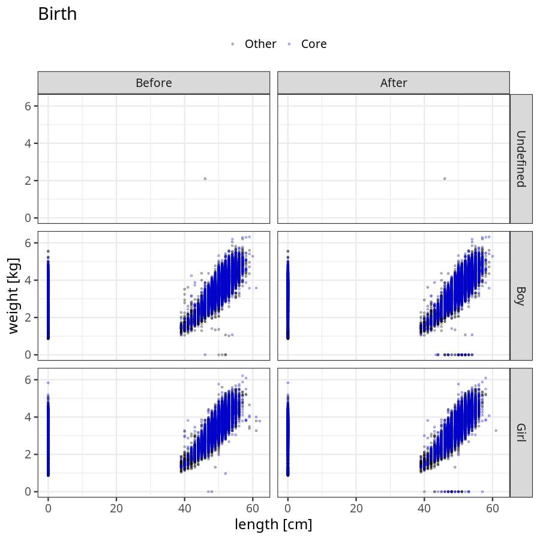
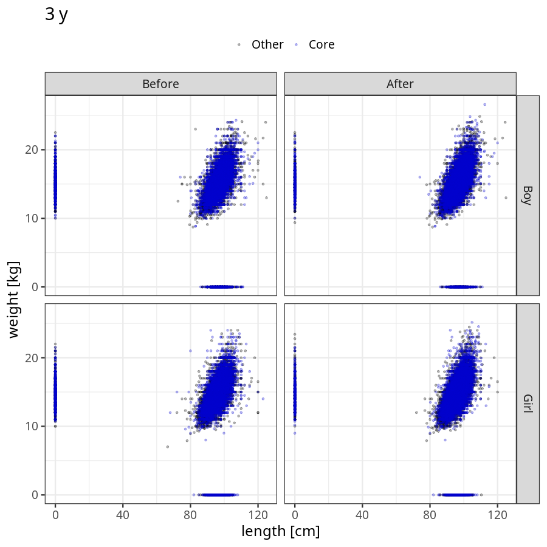
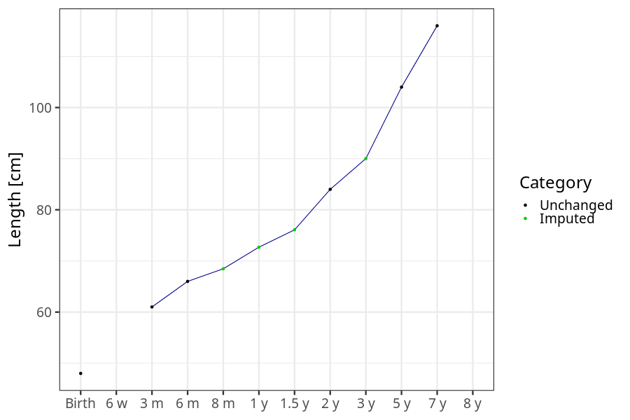
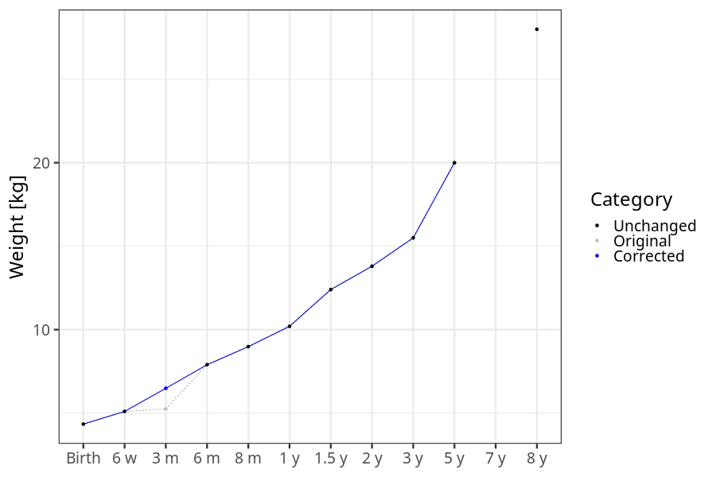
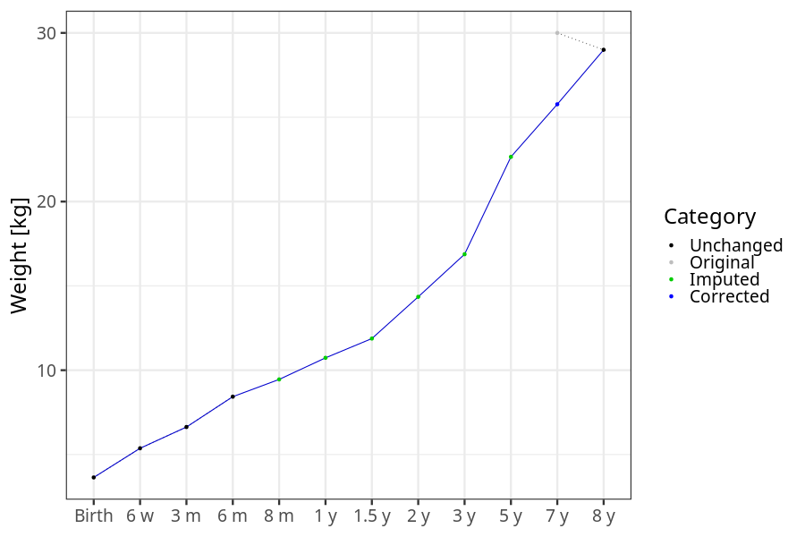
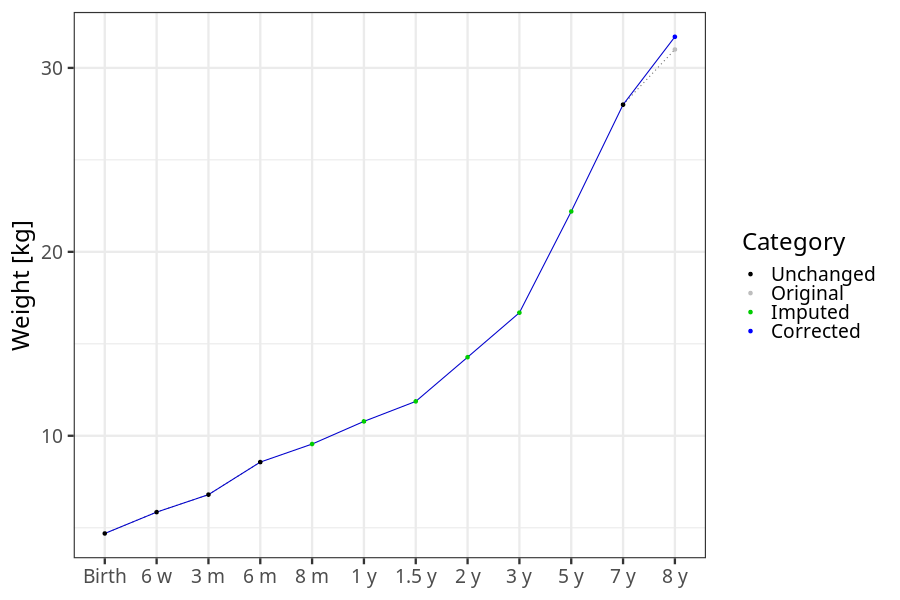

# Phenotypes
### Number of values

### Length vs weight

### Imputation
- Children with no data point altered: 68719
- Children with at least one data point altered: 44904
#### Random example: 83612
> imputed@length_16m imputed@length_2y imputed@weight_16m imputed@weight_2y

#### Random example: 96795
> imputed@length_16m imputed@length_2y imputed@weight_16m imputed@weight_2y

#### Random example: 46874
> imputed@length_16m imputed@length_2y imputed@weight_16m imputed@weight_2y

#### Random example: 50473
> imputed@length_16m imputed@length_2y imputed@weight_16m imputed@weight_2y

#### Random example: 86026
> imputed@length_16m imputed@length_2y imputed@weight_16m imputed@weight_2y

#### Random example: 65709
> imputed@length_16m imputed@length_2y imputed@weight_16m imputed@weight_2y

#### Random example: 112982
> imputed@length_16m imputed@length_2y imputed@weight_16m imputed@weight_2y

#### Random example: 5273
> imputed@length_16m imputed@length_2y imputed@weight_16m imputed@weight_2y

#### Random example: 67310
> imputed@length_16m imputed@length_2y imputed@weight_16m imputed@weight_2y

#### Random example: 78266
> imputed@length_16m imputed@length_2y imputed@weight_16m imputed@weight_2y

#### Random example: 72589
> imputed@length_16m imputed@length_2y imputed@weight_16m imputed@weight_2y

#### Random example: 113030
> imputed@length_16m imputed@length_2y imputed@weight_16m imputed@weight_2y

#### Random example: 83666
> imputed@length_16m imputed@length_2y imputed@weight_16m imputed@weight_2y

#### Random example: 37596
> imputed@length_16m imputed@length_2y imputed@weight_16m imputed@weight_2y

#### Random example: 69810
> imputed@length_16m imputed@length_2y imputed@weight_16m imputed@weight_2y

#### Random example: 20258
> imputed@length_16m imputed@length_2y imputed@weight_16m imputed@weight_2y

#### Random example: 31178
> imputed@length_16m imputed@length_2y imputed@weight_16m imputed@weight_2y

#### Random example: 47799
> imputed@length_16m imputed@length_2y imputed@weight_16m imputed@weight_2y

#### Random example: 9783
> imputed@length_16m imputed@length_2y imputed@weight_16m imputed@weight_2y

#### Random example: 31327
> imputed@length_16m imputed@length_2y imputed@weight_16m imputed@weight_2y

#### Most extreme example (1): 65441
> 

#### Most extreme example (2): 81414
> 

#### Most extreme example (3): 45347
> imputed@length_16m imputed@length_2y imputed@weight_16m imputed@weight_2y

#### Most extreme example (4): 18639
> imputed@length_16m imputed@length_2y imputed@weight_16m imputed@weight_2y

#### Most extreme example (5): 88878
> 

#### Most extreme example (6): 50096
> imputed@length_8m imputed@length_1y imputed@length_16m imputed@weight_8m imputed@weight_1y imputed@weight_16m

#### Most extreme example (7): 88008
> outlier@length_2y imputed@length_2y

#### Most extreme example (8): 112105
> 

#### Most extreme example (9): 93761
> 

#### Most extreme example (10): 59148
> imputed@length_5y imputed@weight_5y

#### Most extreme example (11): 47234
> 

#### Most extreme example (12): 19248
> imputed@weight_6m imputed@weight_8m imputed@weight_16m

#### Most extreme example (13): 96161
> imputed@length_16m imputed@length_2y imputed@weight_16m imputed@weight_2y

#### Most extreme example (14): 31685
> 

#### Most extreme example (15): 61275
> 

#### Most extreme example (16): 95103
> outlier@weight_1y imputed@weight_1y imputed@weight_2y

#### Most extreme example (17): 67688
> 

#### Most extreme example (18): 91518
> 

#### Most extreme example (19): 13142
> imputed@length_16m imputed@length_2y imputed@weight_16m imputed@weight_2y

#### Most extreme example (20): 11401
> 

