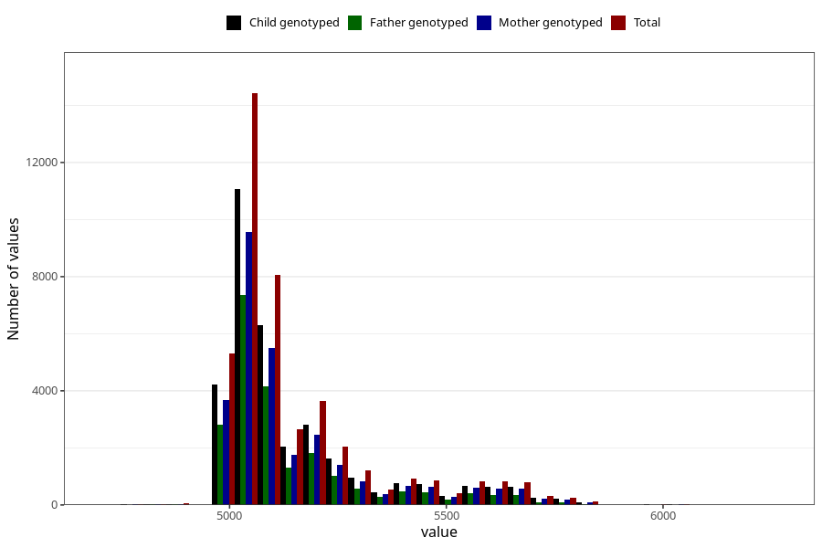

# age_14y
- Number of values:

| Value | Total | Child genotyped | Mother genotyped | Father genotyped |
| ----- | ----- | --------------- | ---------------- | ---------------- |
| Missing | 70221 | 49490 | 42336 | 28372 |
| Non-missing | 43402 | 33865 | 29433 | 21846 |
| 25th percentile | 5022.1875 | 5022.1875 | 5022.1875 | 5022.1875 |
| 50th percentile | 5083.0625 | 5083.0625 | 5083.0625 | 5083.0625 |
| 75th percentile | 5174.375 | 5204.8125 | 5204.8125 | 5174.375 |

