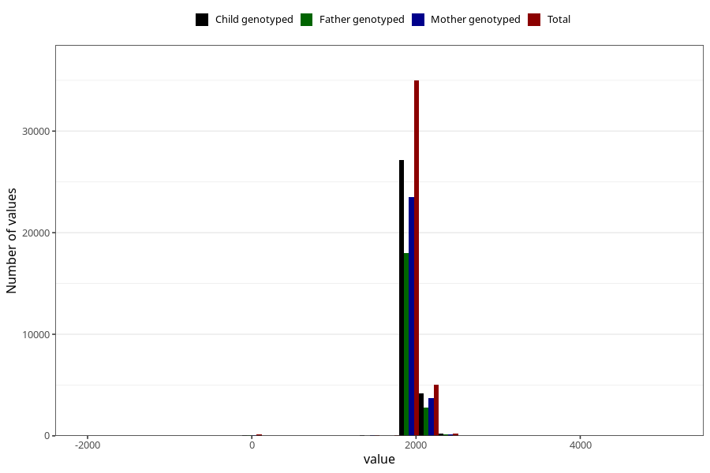

# age_5y
Variable mapping to questionnaire: q7, question AGE_MTHS_Q5AAR.
- Number of values:

| Value | Total | Child genotyped | Mother genotyped | Father genotyped |
| ----- | ----- | --------------- | ---------------- | ---------------- |
| Missing | 73105 | 51627 | 44261 | 29190 |
| Non-missing | 40518 | 31728 | 27508 | 21028 |
| 25th percentile | 1826.25 | 1826.25 | 1826.25 | 1826.25 |
| 50th percentile | 1856.6875 | 1856.6875 | 1856.6875 | 1856.6875 |
| 75th percentile | 1917.5625 | 1948 | 1948 | 1917.5625 |

