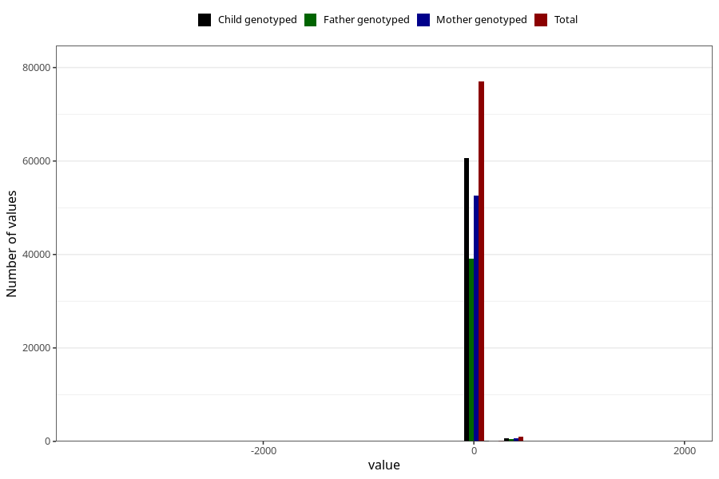

# age_6w
Variable mapping to questionnaire: q4, question ALDER6UK_SJEKK.
- Number of values:

| Value | Total | Child genotyped | Mother genotyped | Father genotyped |
| ----- | ----- | --------------- | ---------------- | ---------------- |
| Missing | 35418 | 21712 | 18368 | 10464 |
| Non-missing | 78205 | 61643 | 53401 | 39754 |
| 25th percentile | 40 | 40 | 40 | 40 |
| 50th percentile | 44 | 44 | 44 | 44 |
| 75th percentile | 48 | 48 | 48 | 48 |

