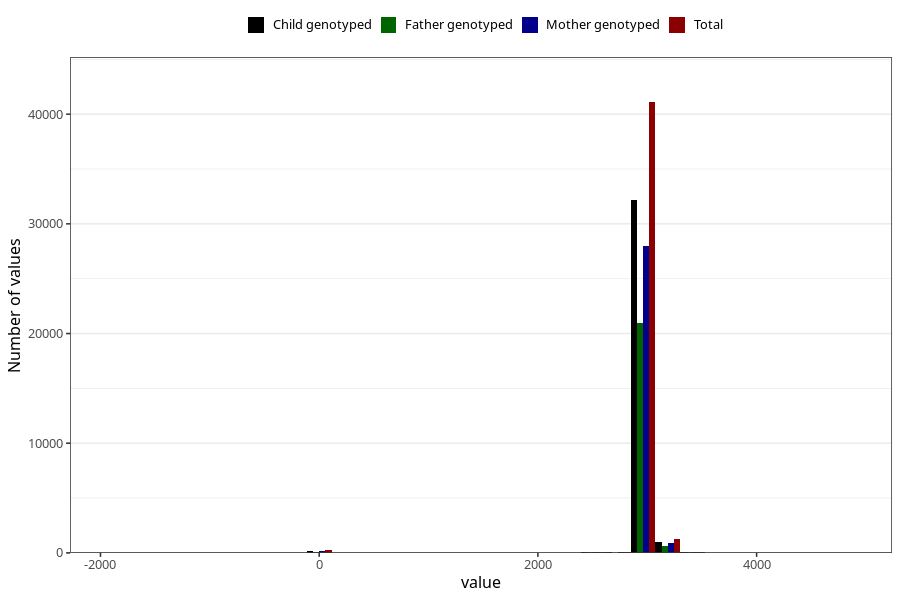

# age_8y
Variable mapping to questionnaire: q9, question AGE_MTHS_Q8AAR.
- Number of values:

| Value | Total | Child genotyped | Mother genotyped | Father genotyped |
| ----- | ----- | --------------- | ---------------- | ---------------- |
| Missing | 70713 | 49710 | 42539 | 28414 |
| Non-missing | 42910 | 33645 | 29230 | 21804 |
| 25th percentile | 2922 | 2922 | 2922 | 2922 |
| 50th percentile | 2952.4375 | 2952.4375 | 2952.4375 | 2952.4375 |
| 75th percentile | 2982.875 | 2982.875 | 2982.875 | 2982.875 |

