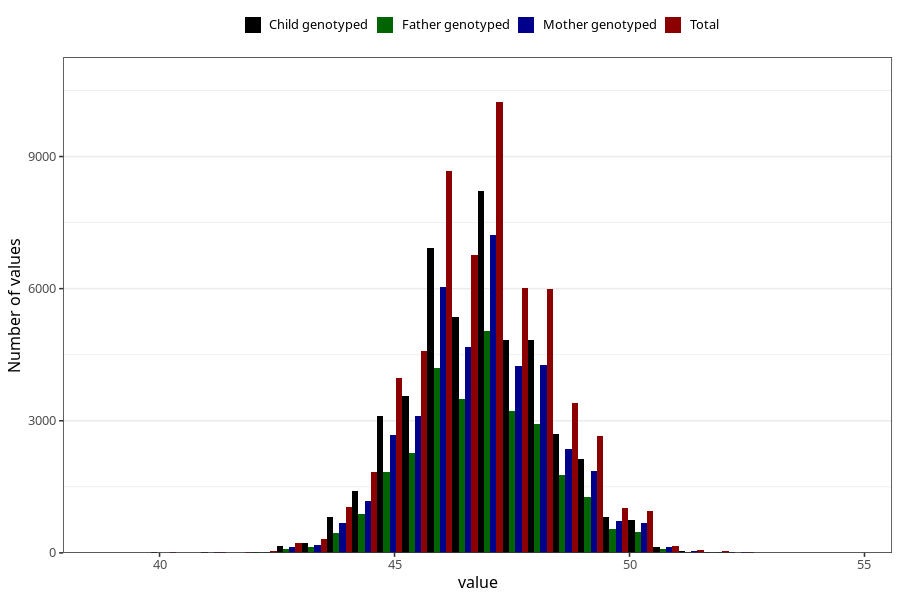

# hc_1y
Variable mapping to questionnaire: q5, question EE394.
- Number of values:

| Value | Total | Child genotyped | Mother genotyped | Father genotyped |
| ----- | ----- | --------------- | ---------------- | ---------------- |
| Missing | 55582 | 37227 | 31528 | 21478 |
| Non-missing | 58041 | 46128 | 40241 | 28740 |
| 25th percentile | 46 | 46 | 46 | 46 |
| 50th percentile | 46.9 | 47 | 47 | 47 |
| 75th percentile | 47.8 | 47.8 | 47.9 | 47.8 |

