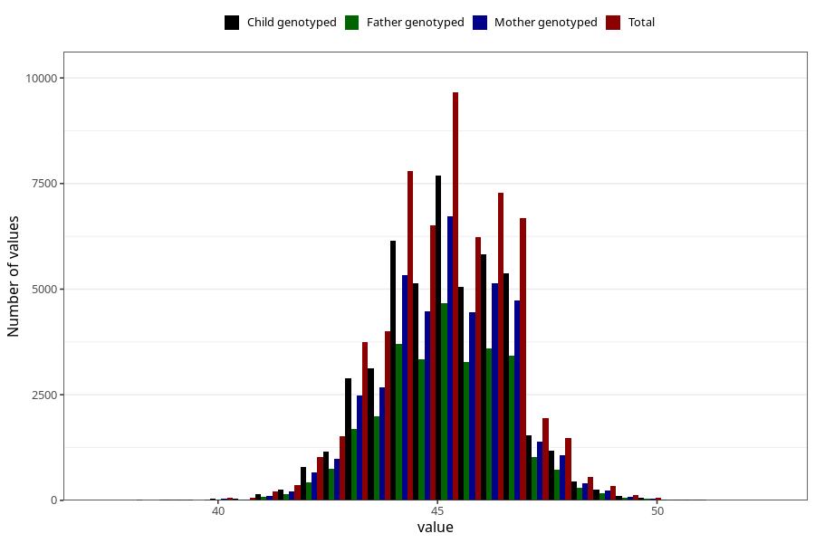

# hc_8m
Variable mapping to questionnaire: q5, question EE388.
- Number of values:

| Value | Total | Child genotyped | Mother genotyped | Father genotyped |
| ----- | ----- | --------------- | ---------------- | ---------------- |
| Missing | 53898 | 36002 | 30479 | 20754 |
| Non-missing | 59725 | 47353 | 41290 | 29464 |
| 25th percentile | 44 | 44 | 44 | 44 |
| 50th percentile | 45 | 45 | 45 | 45 |
| 75th percentile | 46 | 46 | 46 | 46 |

