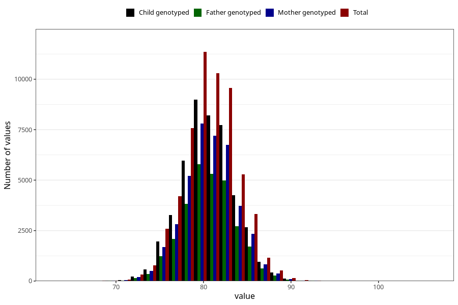

# length_16m
- Number of values:

| Value | Total | Child genotyped | Mother genotyped | Father genotyped |
| ----- | ----- | --------------- | ---------------- | ---------------- |
| Missing | 56245 | 37833 | 32135 | 21025 |
| Non-missing | 57378 | 45522 | 39634 | 29193 |
| 25th percentile | 78.5579405162148 | 78.6693825054537 | 78.699287279267 | 78.7072445157838 |
| 50th percentile | 80.5079568991757 | 80.6295540326664 | 80.6584722078005 | 80.6309981826141 |
| 75th percentile | 82.5343337362768 | 82.6223136924436 | 82.6488380612853 | 82.6054197984512 |

