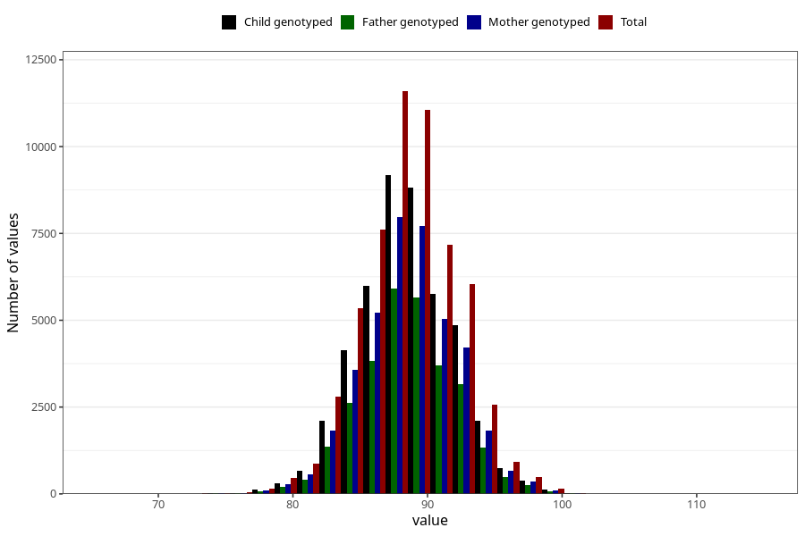

# length_2y
Variable mapping to questionnaire: q6, question GG20.
- Number of values:

| Value | Total | Child genotyped | Mother genotyped | Father genotyped |
| ----- | ----- | --------------- | ---------------- | ---------------- |
| Missing | 56260 | 37957 | 32241 | 21112 |
| Non-missing | 57363 | 45398 | 39528 | 29106 |
| 25th percentile | 86.1011494216202 | 86.2585453262062 | 86.3 | 86.3745011681537 |
| 50th percentile | 88.5 | 88.6 | 88.6328710754808 | 88.6480793285643 |
| 75th percentile | 91 | 91 | 91 | 91 |

