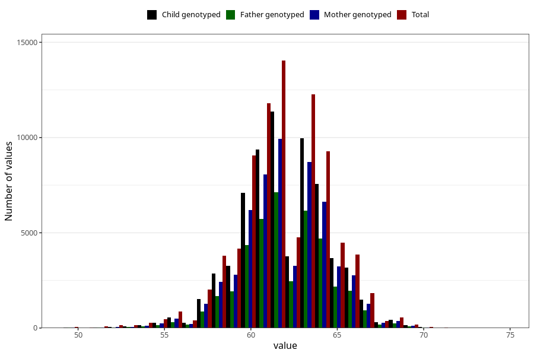

# length_3m
Variable mapping to questionnaire: q4, question DD219.
- Number of values:

| Value | Total | Child genotyped | Mother genotyped | Father genotyped |
| ----- | ----- | --------------- | ---------------- | ---------------- |
| Missing | 28568 | 15865 | 13111 | 8720 |
| Non-missing | 85055 | 67490 | 58658 | 41498 |
| 25th percentile | 60 | 60.5 | 60.5 | 60.5 |
| 50th percentile | 62 | 62 | 62 | 62 |
| 75th percentile | 63.5 | 63.6 | 64 | 63.5995780772687 |

