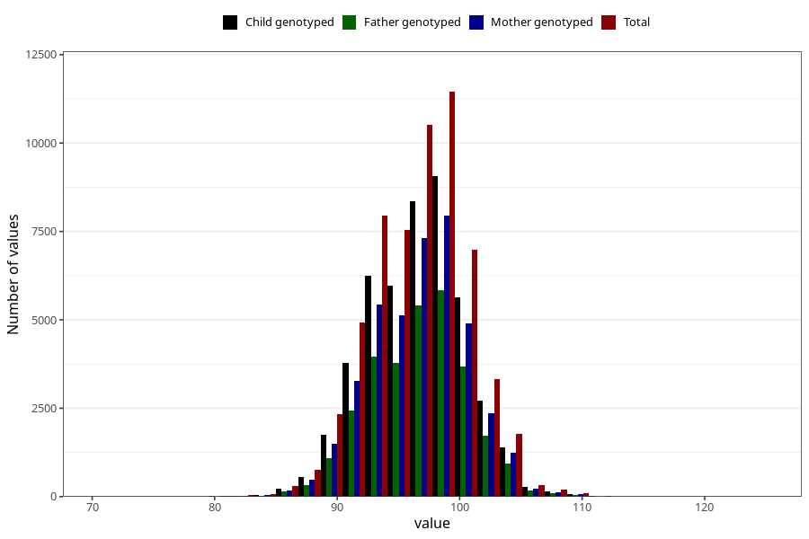

# length_3y
Variable mapping to questionnaire: q6, question GG25.
- Number of values:

| Value | Total | Child genotyped | Mother genotyped | Father genotyped |
| ----- | ----- | --------------- | ---------------- | ---------------- |
| Missing | 54931 | 37014 | 31483 | 20487 |
| Non-missing | 58692 | 46341 | 40286 | 29731 |
| 25th percentile | 94 | 94 | 94 | 94 |
| 50th percentile | 96.7978586603291 | 97 | 97 | 97 |
| 75th percentile | 99 | 99 | 99 | 99 |

