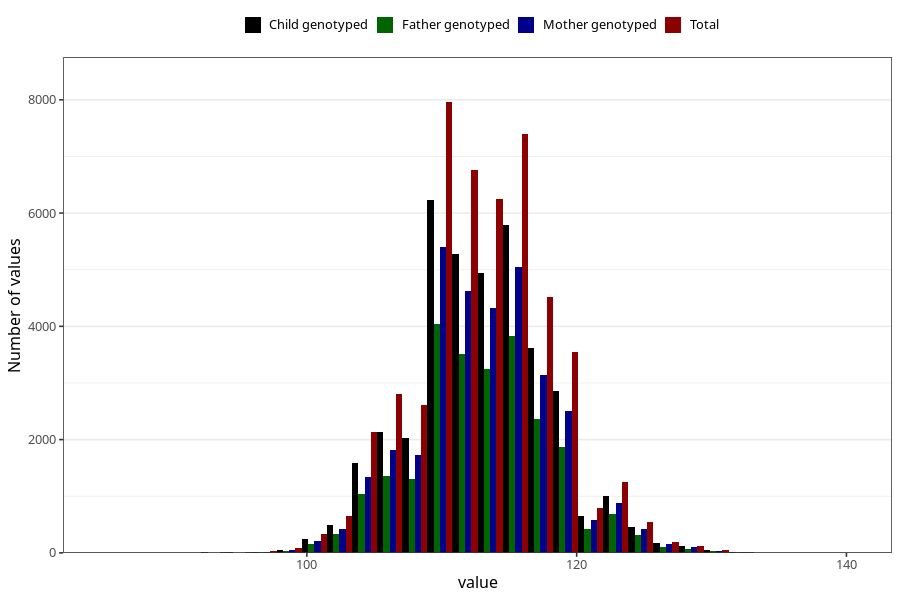

# length_5y
Variable mapping to questionnaire: q7, question LL12.
- Number of values:

| Value | Total | Child genotyped | Mother genotyped | Father genotyped |
| ----- | ----- | --------------- | ---------------- | ---------------- |
| Missing | 65527 | 45574 | 38962 | 25453 |
| Non-missing | 48096 | 37781 | 32807 | 24765 |
| 25th percentile | 110 | 110 | 110 | 110 |
| 50th percentile | 113 | 113 | 113 | 113 |
| 75th percentile | 116 | 116 | 116 | 116 |

