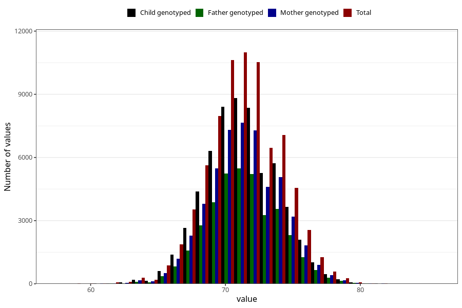

# length_8m
Variable mapping to questionnaire: q5, question EE387.
- Number of values:

| Value | Total | Child genotyped | Mother genotyped | Father genotyped |
| ----- | ----- | --------------- | ---------------- | ---------------- |
| Missing | 38064 | 23487 | 19626 | 13106 |
| Non-missing | 75559 | 59868 | 52143 | 37112 |
| 25th percentile | 69.5 | 69.5 | 69.5 | 69.5 |
| 50th percentile | 71 | 71.2 | 71.3 | 71.3333566367151 |
| 75th percentile | 73 | 73 | 73 | 73 |

