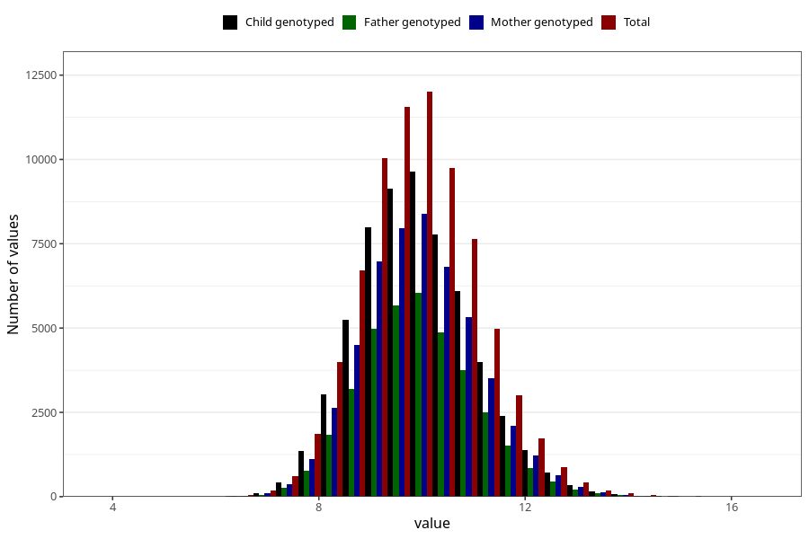

# weight_1y
Variable mapping to questionnaire: q5, question EE392.
- Number of values:

| Value | Total | Child genotyped | Mother genotyped | Father genotyped |
| ----- | ----- | --------------- | ---------------- | ---------------- |
| Missing | 37813 | 23373 | 19526 | 13025 |
| Non-missing | 75810 | 59982 | 52243 | 37193 |
| 25th percentile | 9.145 | 9.17 | 9.18 | 9.18 |
| 50th percentile | 9.87 | 9.89 | 9.9 | 9.9 |
| 75th percentile | 10.64 | 10.65 | 10.66 | 10.65 |

