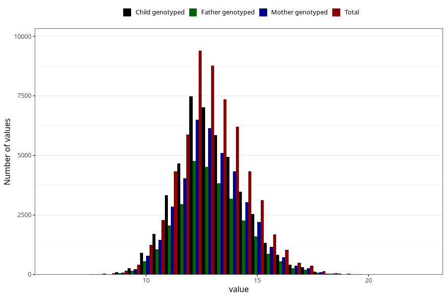

# weight_2y
Variable mapping to questionnaire: q6, question GG21.
- Number of values:

| Value | Total | Child genotyped | Mother genotyped | Father genotyped |
| ----- | ----- | --------------- | ---------------- | ---------------- |
| Missing | 56186 | 37907 | 32216 | 21104 |
| Non-missing | 57437 | 45448 | 39553 | 29114 |
| 25th percentile | 11.9537577027415 | 12 | 12 | 12 |
| 50th percentile | 12.9 | 12.9264436962933 | 12.9408788957515 | 12.9595297709759 |
| 75th percentile | 13.9636695560344 | 14 | 14 | 14 |

