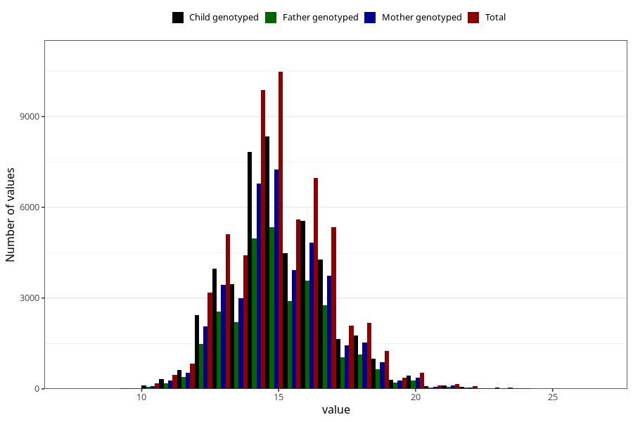

# weight_3y
Variable mapping to questionnaire: q6, question GG26.
- Number of values:

| Value | Total | Child genotyped | Mother genotyped | Father genotyped |
| ----- | ----- | --------------- | ---------------- | ---------------- |
| Missing | 54262 | 36514 | 31070 | 20218 |
| Non-missing | 59361 | 46841 | 40699 | 30000 |
| 25th percentile | 14 | 14 | 14 | 14 |
| 50th percentile | 15 | 15 | 15 | 15 |
| 75th percentile | 16 | 16 | 16 | 16 |

