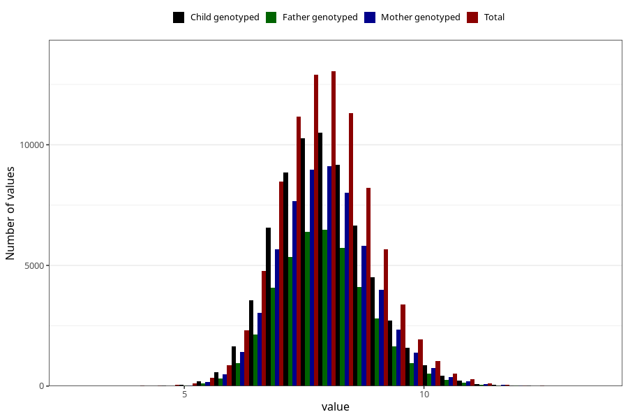

# weight_6m
Variable mapping to questionnaire: q4, question DD224.
- Number of values:

| Value | Total | Child genotyped | Mother genotyped | Father genotyped |
| ----- | ----- | --------------- | ---------------- | ---------------- |
| Missing | 26972 | 14786 | 12179 | 8055 |
| Non-missing | 86651 | 68569 | 59590 | 42163 |
| 25th percentile | 7.235 | 7.26720145841635 | 7.27 | 7.275 |
| 50th percentile | 7.86 | 7.88 | 7.89 | 7.89 |
| 75th percentile | 8.51 | 8.525 | 8.53 | 8.52469895815094 |

