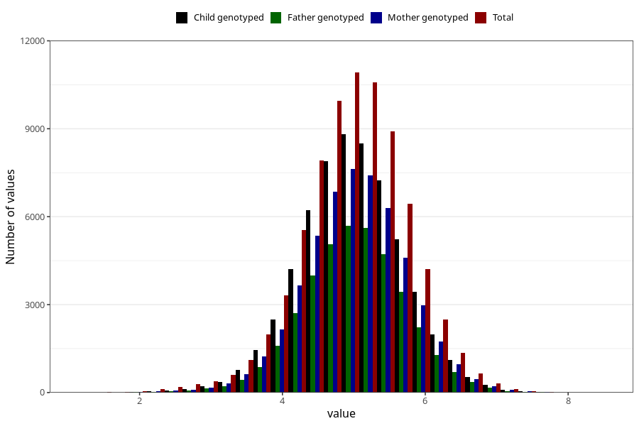

# weight_6w
Variable mapping to questionnaire: q4, question DD212.
- Number of values:

| Value | Total | Child genotyped | Mother genotyped | Father genotyped |
| ----- | ----- | --------------- | ---------------- | ---------------- |
| Missing | 36028 | 22148 | 18733 | 10731 |
| Non-missing | 77595 | 61207 | 53036 | 39487 |
| 25th percentile | 4.52 | 4.56 | 4.565 | 4.57 |
| 50th percentile | 5 | 5.015 | 5.02 | 5.028 |
| 75th percentile | 5.46 | 5.48 | 5.48 | 5.48 |

