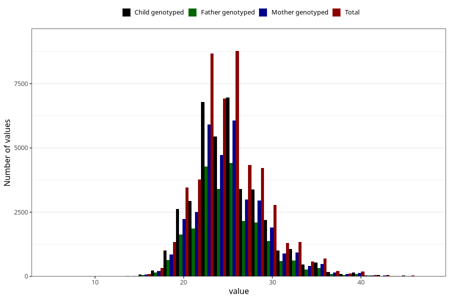

# weight_7y
Variable mapping to questionnaire: q8, question JJ325.
- Number of values:

| Value | Total | Child genotyped | Mother genotyped | Father genotyped |
| ----- | ----- | --------------- | ---------------- | ---------------- |
| Missing | 64259 | 44626 | 38107 | 25980 |
| Non-missing | 49364 | 38729 | 33662 | 24238 |
| 25th percentile | 22.3 | 22.5 | 22.5 | 22.4 |
| 50th percentile | 24.9 | 25 | 25 | 25 |
| 75th percentile | 27.3 | 27.4 | 27.5 | 27.2 |

