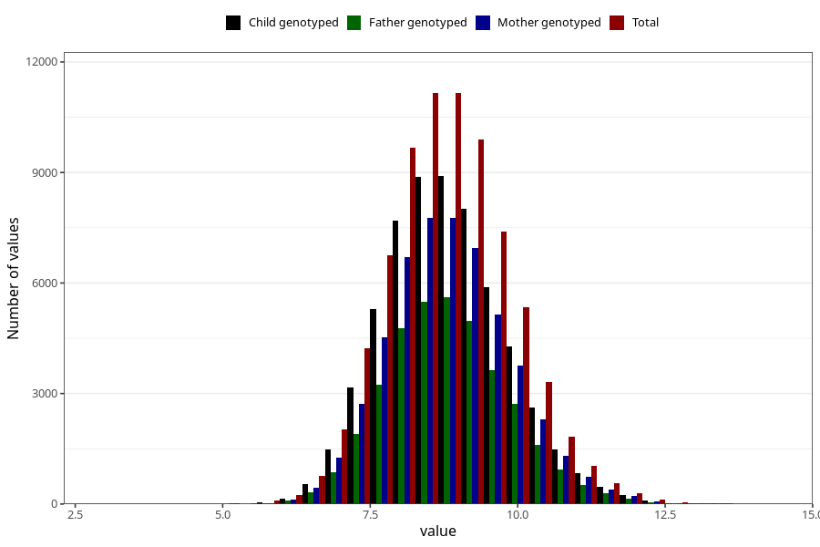

# weight_8m
Variable mapping to questionnaire: q5, question EE386.
- Number of values:

| Value | Total | Child genotyped | Mother genotyped | Father genotyped |
| ----- | ----- | --------------- | ---------------- | ---------------- |
| Missing | 37637 | 23209 | 19387 | 12950 |
| Non-missing | 75986 | 60146 | 52382 | 37268 |
| 25th percentile | 8.09 | 8.115 | 8.12 | 8.13 |
| 50th percentile | 8.75903721241183 | 8.77880558974073 | 8.78 | 8.78 |
| 75th percentile | 9.47 | 9.48 | 9.49 | 9.485 |

