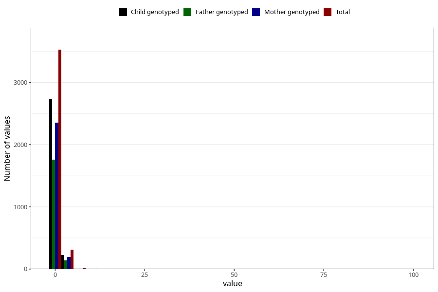

# bronchitis_rs_virus_pneumonia_freq_6m
Variable mapping to questionnaire: q4, question DD280.
- Number of values:

| Value | Total | Child genotyped | Mother genotyped | Father genotyped |
| ----- | ----- | --------------- | ---------------- | ---------------- |
| Missing | 109759 | 80377 | 69207 | 48316 |
| Non-missing | 3864 | 2978 | 2562 | 1902 |
| 0 | 118 | 91 | 76 | 60 |
| 1 | 3409 | 2645 | 2279 | 1697 |
| 2 | 243 | 175 | 149 | 105 |
| 3 | 54 | 42 | 35 | 27 |
| 4 | 10 | 8 | 7 | 4 |
| 5 | 6 | 4 | 3 | 2 |
| 6 | 4 | 3 | 3 | 1 |
| 7 | 5 | 3 | 3 | 3 |
| 8 | 4 | 1 | 1 | 0 |
| 9 | 2 | 1 | 1 | 1 |
| 10 | 3 | 1 | 1 | 0 |
| 12 | 1 | 1 | 1 | 0 |
| 14 | 1 | 1 | 1 | 0 |
| 16 | 2 | 1 | 1 | 1 |
| 30 | 1 | 0 | 0 | 0 |
| 99 | 1 | 1 | 1 | 1 |

