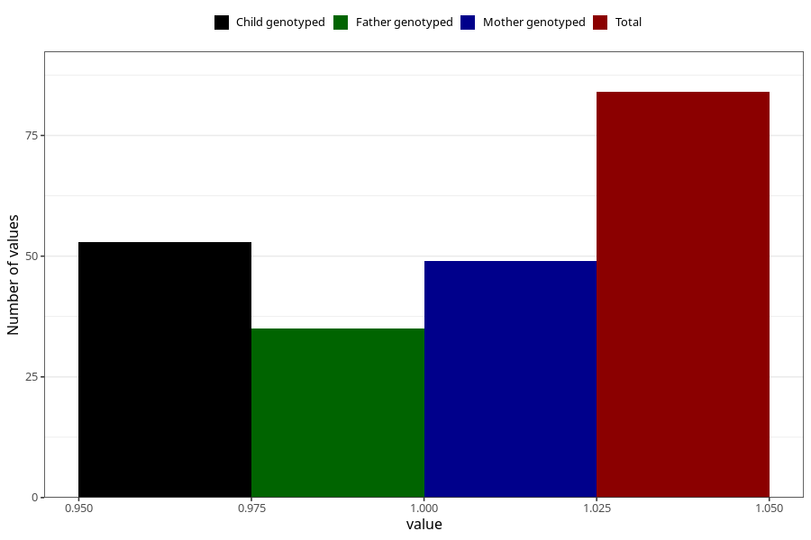

# cerebral_palsy_8y
Variable mapping to questionnaire: q9, question NN33.
- Number of values:

| Value | Total | Child genotyped | Mother genotyped | Father genotyped |
| ----- | ----- | --------------- | ---------------- | ---------------- |
| Missing | 113539 | 83302 | 71720 | 50183 |
| Non-missing | 84 | 53 | 49 | 35 |
| 1 | 84 | 53 | 49 | 35 |

