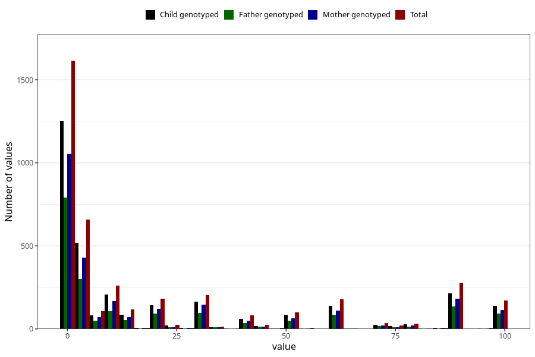

# colic_freq_6m
Variable mapping to questionnaire: q4, question DD304.
- Number of values:

| Value | Total | Child genotyped | Mother genotyped | Father genotyped |
| ----- | ----- | --------------- | ---------------- | ---------------- |
| Missing | 109487 | 80110 | 69067 | 48230 |
| Non-missing | 4136 | 3245 | 2702 | 1988 |
| 25th percentile | 1 | 1 | 1 | 1 |
| 50th percentile | 4 | 4 | 4 | 4 |
| 75th percentile | 30 | 30 | 30 | 30 |

