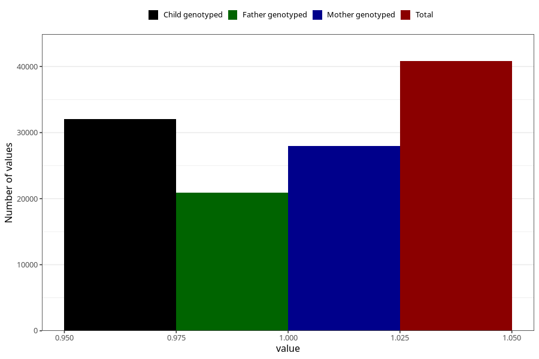

# hyperactivity_no_8y
Variable mapping to questionnaire: q9, question NN44.
- Number of values:

| Value | Total | Child genotyped | Mother genotyped | Father genotyped |
| ----- | ----- | --------------- | ---------------- | ---------------- |
| Missing | 72809 | 51316 | 43804 | 29302 |
| Non-missing | 40814 | 32039 | 27965 | 20916 |
| 1 | 40814 | 32039 | 27965 | 20916 |

