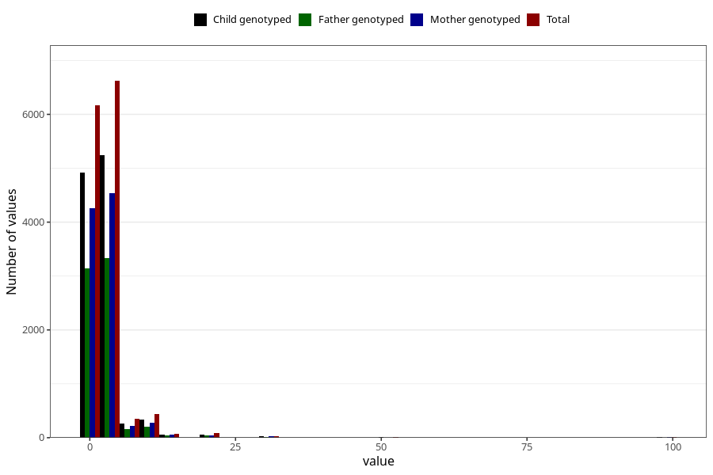

# nappy_rash_freq_6m
Variable mapping to questionnaire: q4, question DD308.
- Number of values:

| Value | Total | Child genotyped | Mother genotyped | Father genotyped |
| ----- | ----- | --------------- | ---------------- | ---------------- |
| Missing | 99821 | 72411 | 62320 | 43274 |
| Non-missing | 13802 | 10944 | 9449 | 6944 |
| 25th percentile | 1 | 1 | 1 | 1 |
| 50th percentile | 2 | 2 | 2 | 2 |
| 75th percentile | 3 | 3 | 3 | 3 |

