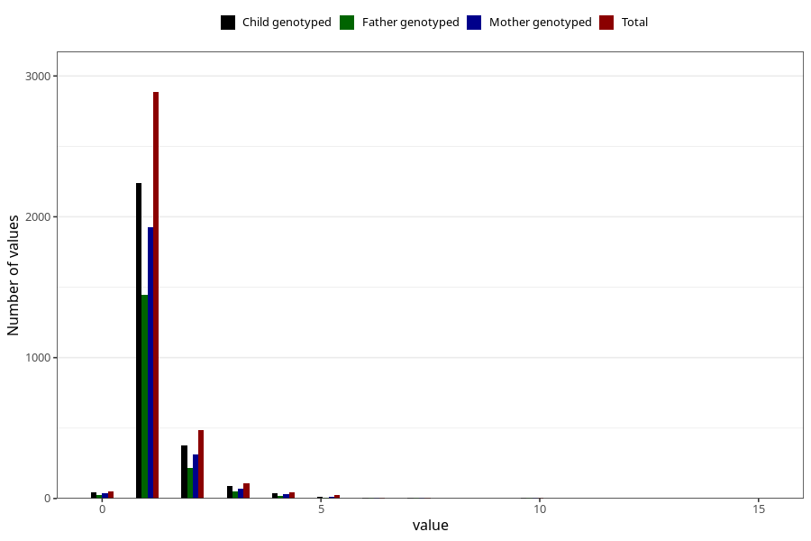

# pneumonia_freq_3y
Variable mapping to questionnaire: q6, question GG147.
- Number of values:

| Value | Total | Child genotyped | Mother genotyped | Father genotyped |
| ----- | ----- | --------------- | ---------------- | ---------------- |
| Missing | 110000 | 80545 | 69372 | 48439 |
| Non-missing | 3623 | 2810 | 2397 | 1779 |
| 0 | 53 | 42 | 37 | 26 |
| 1 | 2885 | 2239 | 1923 | 1447 |
| 2 | 483 | 376 | 312 | 215 |
| 3 | 106 | 86 | 68 | 53 |
| 4 | 47 | 36 | 30 | 19 |
| 5 | 26 | 15 | 12 | 8 |
| 6 | 6 | 5 | 5 | 4 |
| 7 | 8 | 4 | 4 | 3 |
| 8 | 1 | 0 | 0 | 0 |
| 9 | 1 | 1 | 1 | 0 |
| 10 | 3 | 3 | 3 | 3 |
| 11 | 1 | 1 | 0 | 0 |
| 12 | 1 | 1 | 1 | 0 |
| 14 | 1 | 0 | 0 | 0 |
| 15 | 1 | 1 | 1 | 1 |

