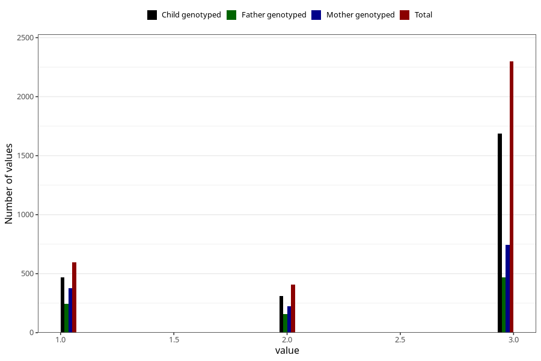

# vaccine_hepatitis_b_freq_18m
Variable mapping to questionnaire: q5, question EE163.
- Number of values:

| Value | Total | Child genotyped | Mother genotyped | Father genotyped |
| ----- | ----- | --------------- | ---------------- | ---------------- |
| Missing | 110319 | 80890 | 70425 | 49350 |
| Non-missing | 3304 | 2465 | 1344 | 868 |
| 1 | 598 | 466 | 375 | 246 |
| 2 | 408 | 312 | 223 | 156 |
| 3 | 2298 | 1687 | 746 | 466 |

