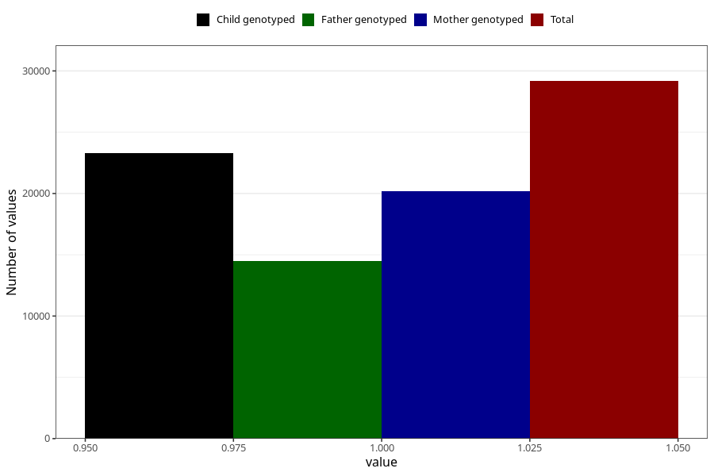

# breastmilk_12_14m
Variable mapping to questionnaire: q5, question EE14.
- Number of values:

| Value | Total | Child genotyped | Mother genotyped | Father genotyped |
| ----- | ----- | --------------- | ---------------- | ---------------- |
| Missing | 84451 | 60056 | 51570 | 35745 |
| Non-missing | 29172 | 23299 | 20199 | 14473 |
| 1 | 29172 | 23299 | 20199 | 14473 |

