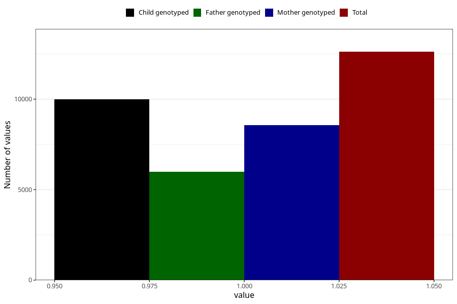

# breastmilk_15_18m
Variable mapping to questionnaire: q5, question EE15.
- Number of values:

| Value | Total | Child genotyped | Mother genotyped | Father genotyped |
| ----- | ----- | --------------- | ---------------- | ---------------- |
| Missing | 101006 | 73358 | 63193 | 44229 |
| Non-missing | 12617 | 9997 | 8576 | 5989 |
| 1 | 12617 | 9997 | 8576 | 5989 |

