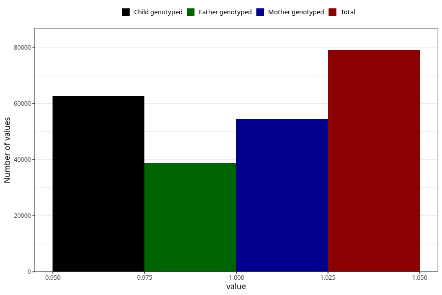

# breastmilk_4m
Variable mapping to questionnaire: q4, question DD53.
- Number of values:

| Value | Total | Child genotyped | Mother genotyped | Father genotyped |
| ----- | ----- | --------------- | ---------------- | ---------------- |
| Missing | 34707 | 20755 | 17343 | 11566 |
| Non-missing | 78916 | 62600 | 54426 | 38652 |
| 1 | 78916 | 62600 | 54426 | 38652 |

