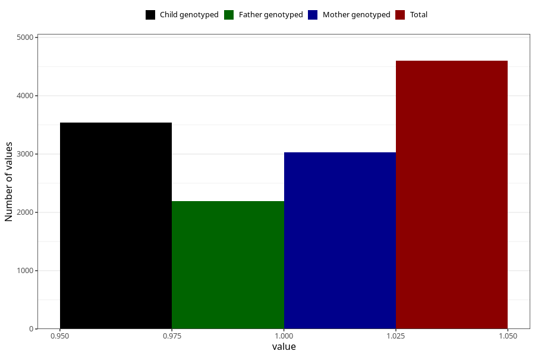

# formula_15_18m
Variable mapping to questionnaire: q5, question EE19.
- Number of values:

| Value | Total | Child genotyped | Mother genotyped | Father genotyped |
| ----- | ----- | --------------- | ---------------- | ---------------- |
| Missing | 109024 | 79815 | 68743 | 48024 |
| Non-missing | 4599 | 3540 | 3026 | 2194 |
| 1 | 4599 | 3540 | 3026 | 2194 |

