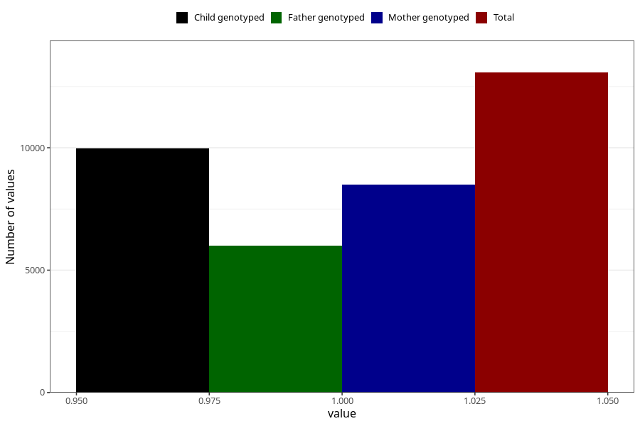

# formula_1m
- Number of values:

| Value | Total | Child genotyped | Mother genotyped | Father genotyped |
| ----- | ----- | --------------- | ---------------- | ---------------- |
| Missing | 100550 | 73380 | 63265 | 44204 |
| Non-missing | 13073 | 9975 | 8504 | 6014 |
| 1 | 13073 | 9975 | 8504 | 6014 |

