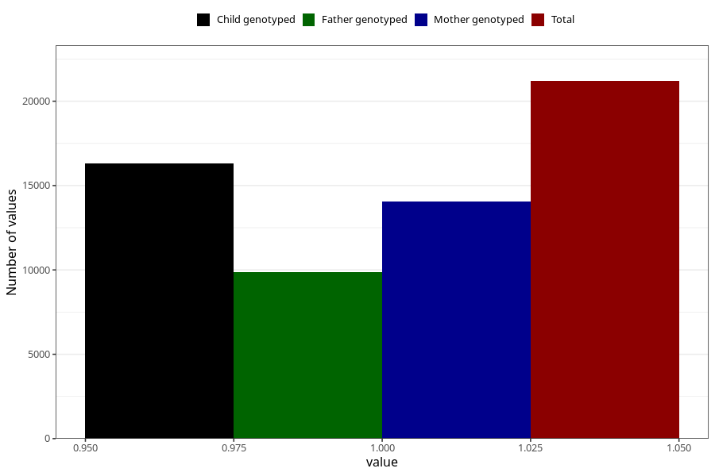

# formula_3m
- Number of values:

| Value | Total | Child genotyped | Mother genotyped | Father genotyped |
| ----- | ----- | --------------- | ---------------- | ---------------- |
| Missing | 92430 | 67065 | 57721 | 40343 |
| Non-missing | 21193 | 16290 | 14048 | 9875 |
| 1 | 21193 | 16290 | 14048 | 9875 |

