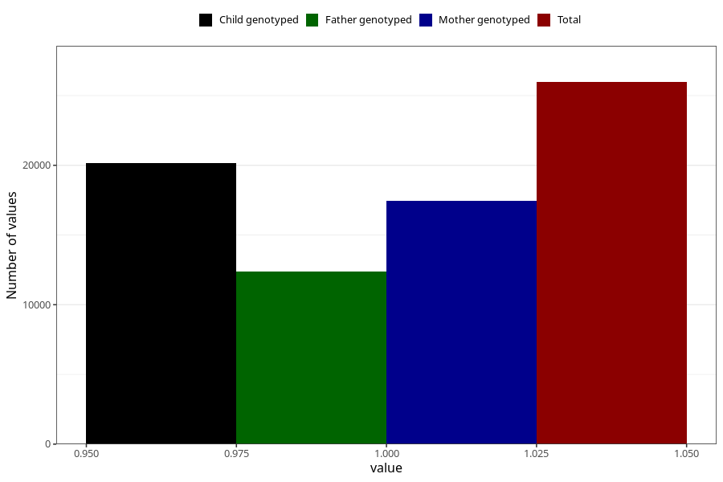

# formula_6_8m
Variable mapping to questionnaire: q5, question EE16.
- Number of values:

| Value | Total | Child genotyped | Mother genotyped | Father genotyped |
| ----- | ----- | --------------- | ---------------- | ---------------- |
| Missing | 87657 | 63208 | 54324 | 37832 |
| Non-missing | 25966 | 20147 | 17445 | 12386 |
| 1 | 25966 | 20147 | 17445 | 12386 |

