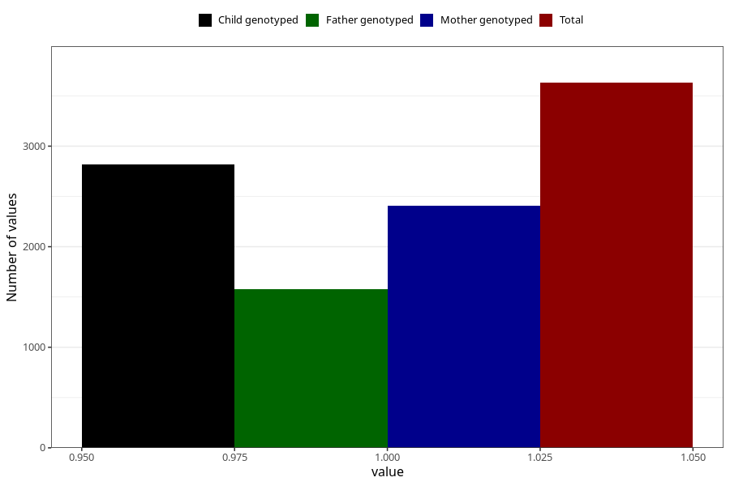

# formula_colett_omega3_3m
Variable mapping to questionnaire: q4, question DD66.
- Number of values:

| Value | Total | Child genotyped | Mother genotyped | Father genotyped |
| ----- | ----- | --------------- | ---------------- | ---------------- |
| Missing | 109993 | 80534 | 69362 | 48640 |
| Non-missing | 3630 | 2821 | 2407 | 1578 |
| 1 | 3630 | 2821 | 2407 | 1578 |

