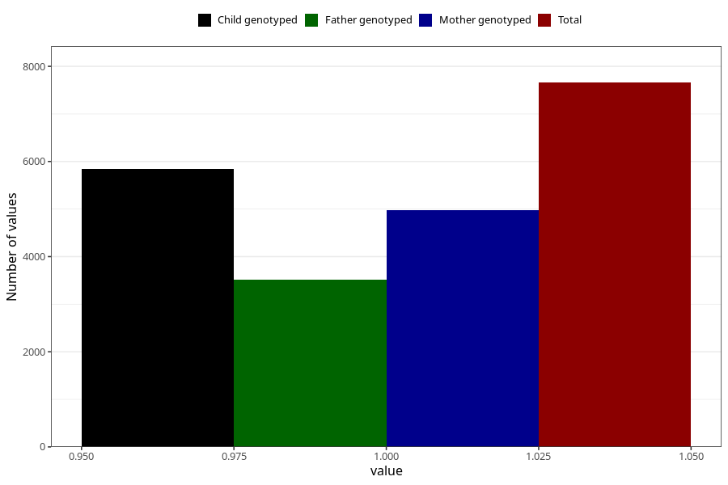

# formula_nan_0m
Variable mapping to questionnaire: q4, question DD70.
- Number of values:

| Value | Total | Child genotyped | Mother genotyped | Father genotyped |
| ----- | ----- | --------------- | ---------------- | ---------------- |
| Missing | 105965 | 77512 | 66795 | 46706 |
| Non-missing | 7658 | 5843 | 4974 | 3512 |
| 1 | 7658 | 5843 | 4974 | 3512 |

