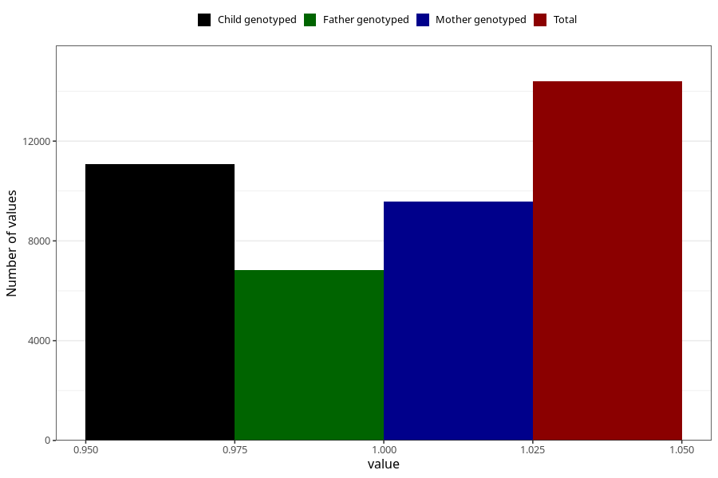

# formula_nan_3m
Variable mapping to questionnaire: q4, question DD73.
- Number of values:

| Value | Total | Child genotyped | Mother genotyped | Father genotyped |
| ----- | ----- | --------------- | ---------------- | ---------------- |
| Missing | 99230 | 72278 | 62199 | 43378 |
| Non-missing | 14393 | 11077 | 9570 | 6840 |
| 1 | 14393 | 11077 | 9570 | 6840 |

