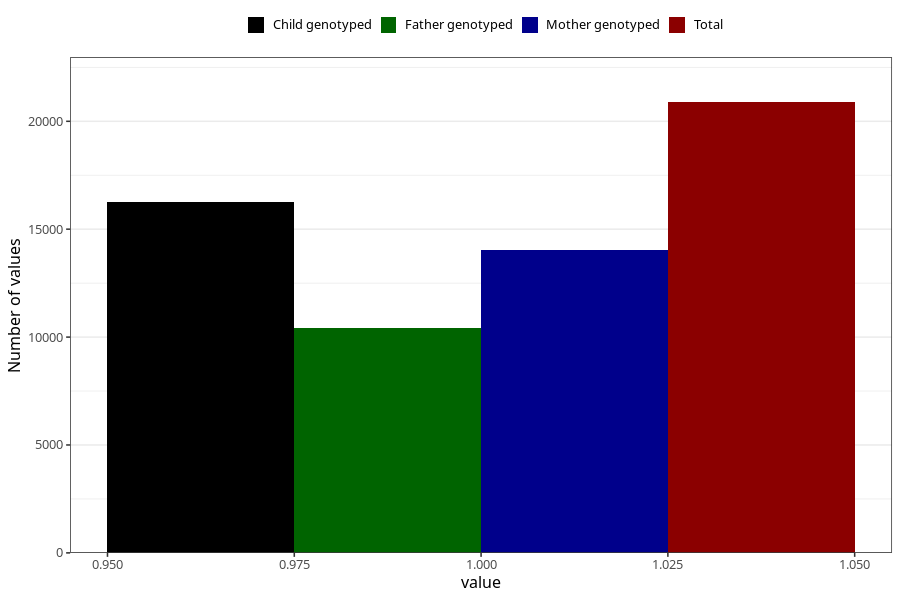

# formula_nan_6m
Variable mapping to questionnaire: q4, question DD76.
- Number of values:

| Value | Total | Child genotyped | Mother genotyped | Father genotyped |
| ----- | ----- | --------------- | ---------------- | ---------------- |
| Missing | 92738 | 67118 | 57715 | 39790 |
| Non-missing | 20885 | 16237 | 14054 | 10428 |
| 1 | 20885 | 16237 | 14054 | 10428 |

