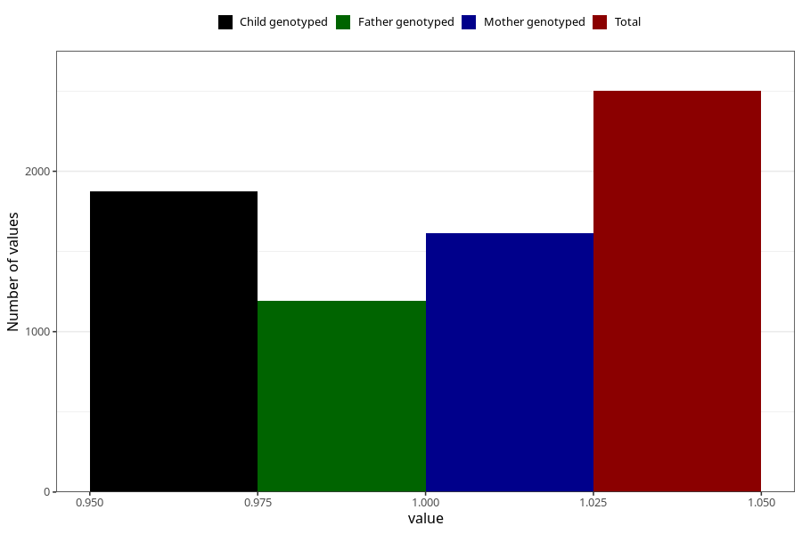

# formula_nan_ha1_1m
Variable mapping to questionnaire: q4, question DD78.
- Number of values:

| Value | Total | Child genotyped | Mother genotyped | Father genotyped |
| ----- | ----- | --------------- | ---------------- | ---------------- |
| Missing | 111122 | 81481 | 70157 | 49027 |
| Non-missing | 2501 | 1874 | 1612 | 1191 |
| 1 | 2501 | 1874 | 1612 | 1191 |

