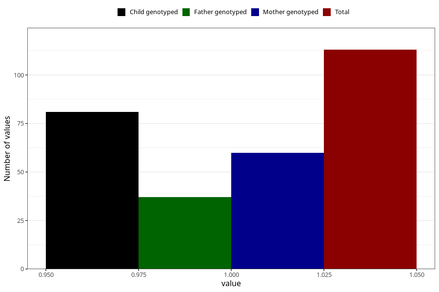

# amphetamine_before
Variable mapping to questionnaire: q1m, question AA1438.
- Number of values:

| Value | Total | Child genotyped | Mother genotyped | Father genotyped |
| ----- | ----- | --------------- | ---------------- | ---------------- |
| Missing | 113510 | 83274 | 71709 | 50181 |
| Non-missing | 113 | 81 | 60 | 37 |
| 1 | 113 | 81 | 60 | 37 |

