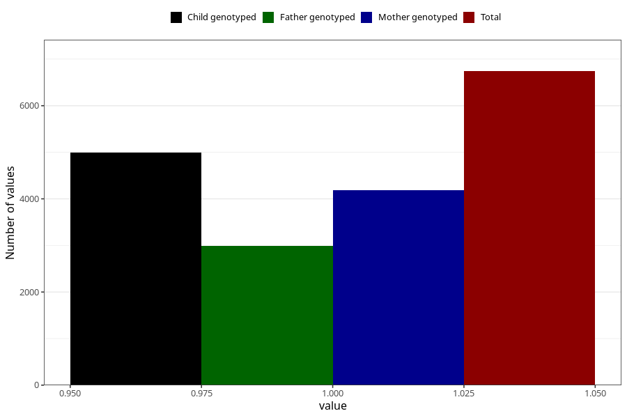

# depression_before
Variable mapping to questionnaire: q1m, question AA869.
- Number of values:

| Value | Total | Child genotyped | Mother genotyped | Father genotyped |
| ----- | ----- | --------------- | ---------------- | ---------------- |
| Missing | 106882 | 78367 | 67588 | 47223 |
| Non-missing | 6741 | 4988 | 4181 | 2995 |
| 1 | 6741 | 4988 | 4181 | 2995 |

