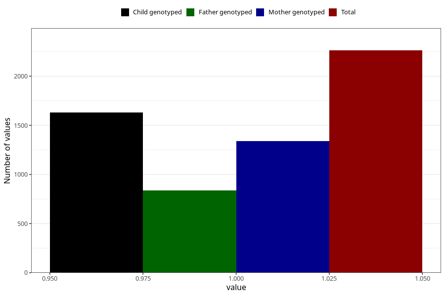

# depression_during
Variable mapping to questionnaire: q1m, question AA870.
- Number of values:

| Value | Total | Child genotyped | Mother genotyped | Father genotyped |
| ----- | ----- | --------------- | ---------------- | ---------------- |
| Missing | 111361 | 81725 | 70428 | 49379 |
| Non-missing | 2262 | 1630 | 1341 | 839 |
| 1 | 2262 | 1630 | 1341 | 839 |

