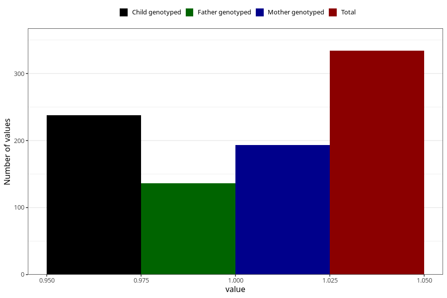

# eating_disorders_during
Variable mapping to questionnaire: q1m, question AA807.
- Number of values:

| Value | Total | Child genotyped | Mother genotyped | Father genotyped |
| ----- | ----- | --------------- | ---------------- | ---------------- |
| Missing | 113289 | 83117 | 71576 | 50082 |
| Non-missing | 334 | 238 | 193 | 136 |
| 1 | 334 | 238 | 193 | 136 |

