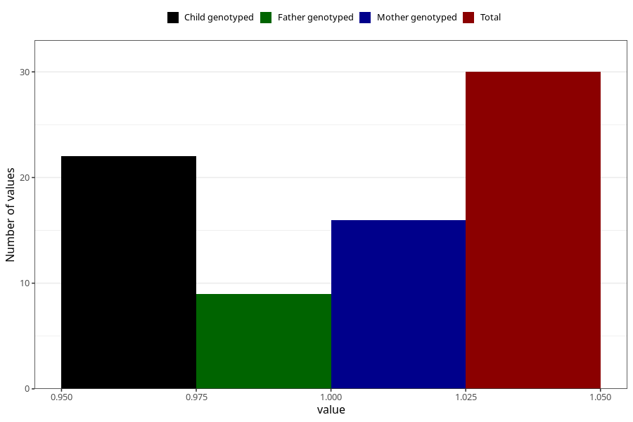

# ecstasy_before
Variable mapping to questionnaire: q1m, question AA1442.
- Number of values:

| Value | Total | Child genotyped | Mother genotyped | Father genotyped |
| ----- | ----- | --------------- | ---------------- | ---------------- |
| Missing | 113593 | 83333 | 71753 | 50209 |
| Non-missing | 30 | 22 | 16 | 9 |
| 1 | 30 | 22 | 16 | 9 |

