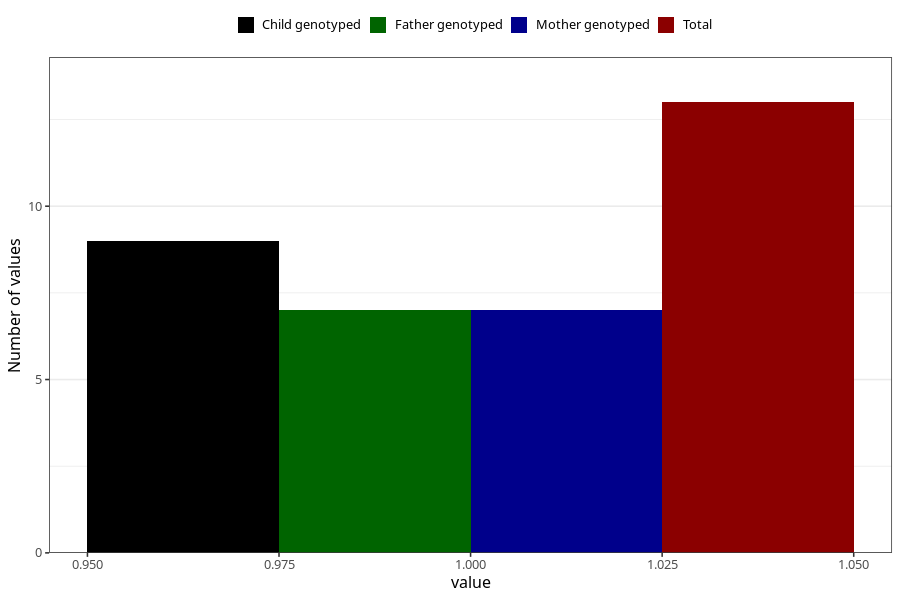

# ecstasy_during
Variable mapping to questionnaire: q1m, question AA1443.
- Number of values:

| Value | Total | Child genotyped | Mother genotyped | Father genotyped |
| ----- | ----- | --------------- | ---------------- | ---------------- |
| Missing | 113610 | 83346 | 71762 | 50211 |
| Non-missing | 13 | 9 | 7 | 7 |
| 1 | 13 | 9 | 7 | 7 |

