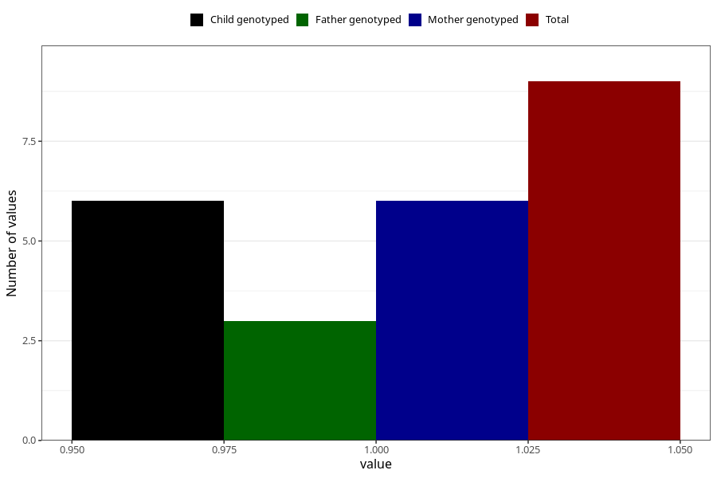

# heroin_before
Variable mapping to questionnaire: q1m, question AA1450.
- Number of values:

| Value | Total | Child genotyped | Mother genotyped | Father genotyped |
| ----- | ----- | --------------- | ---------------- | ---------------- |
| Missing | 113614 | 83349 | 71763 | 50215 |
| Non-missing | 9 | 6 | 6 | 3 |
| 1 | 9 | 6 | 6 | 3 |

