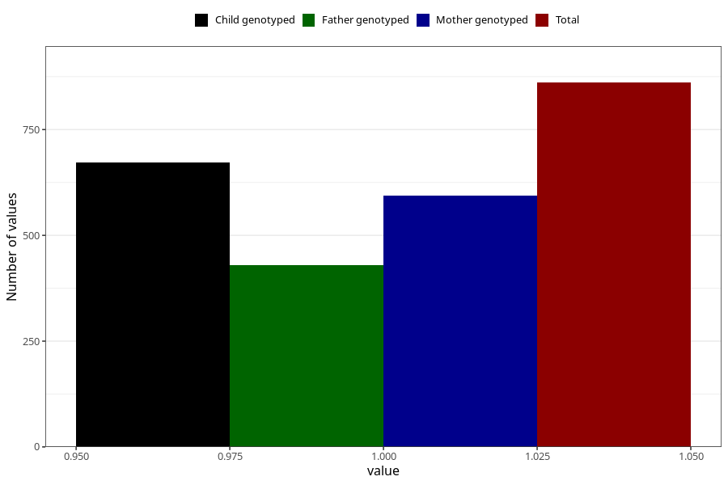

# high_cholesterol_before
Variable mapping to questionnaire: q1m, question AA545.
- Number of values:

| Value | Total | Child genotyped | Mother genotyped | Father genotyped |
| ----- | ----- | --------------- | ---------------- | ---------------- |
| Missing | 112762 | 82683 | 71175 | 49788 |
| Non-missing | 861 | 672 | 594 | 430 |
| 1 | 861 | 672 | 594 | 430 |

