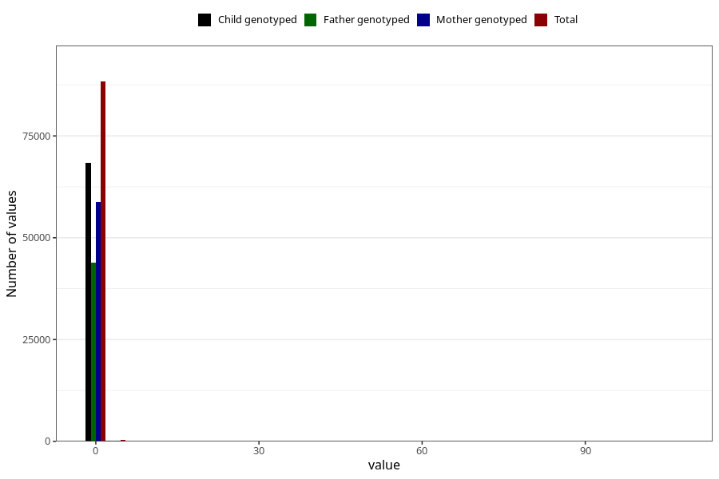

# alcohol
Variable mapping to questionnaire: q2, question ALKOHOL.
- Number of values:

| Value | Total | Child genotyped | Mother genotyped | Father genotyped |
| ----- | ----- | --------------- | ---------------- | ---------------- |
| Missing | 24927 | 14790 | 12674 | 6238 |
| Non-missing | 88696 | 68565 | 59095 | 43980 |
| 25th percentile | 0 | 0 | 0 | 0 |
| 50th percentile | 0 | 0 | 0 | 0 |
| 75th percentile | 0 | 0 | 0 | 0 |

